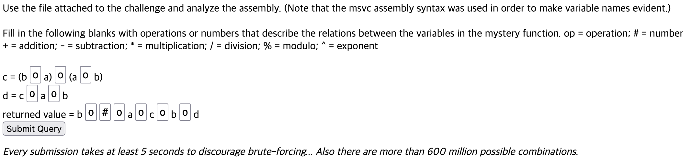
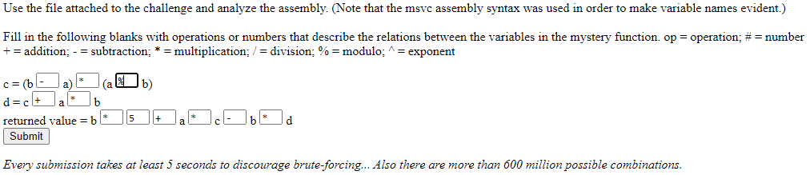
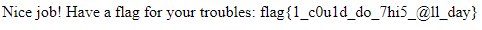

# Avengers Assemble 2 Write-Up

* * *

## Challenges Description

```
Time for some more exploiting-secret-clubs'-authorization-software-to-gain-access fun! This time, they gave us a file and a website to input our responses. I would do it myself but I have... homework. mhsctf-avengersassemble2.0xmmalik.repl.co (you may need to wait for the site to wake up) Note: the file uses the .asm extension which is not necessarily entirely accurate. Don't try to brute force the website, there are over 600 million possible combinations.
```

* * *

## File and Web page

> [avengers2.asm](./avengers2.asm)



* * *

## Analyze

This challenges is also provided assembly file but it's **MSVC syntax**. I notice it's something different intel syntax but not sure is what.

Let's moved on description. You can find some link and another description in there.

```
Use the file attached to the challenge and analyze the assembly. (Note that the msvc assembly syntax was used in order to make variable names evident.)

Fill in the following blanks with operations or numbers that describe the relations between the variables in the mystery function. op = operation; # = number
+ = addition; - = subtraction; * = multiplication; / = division; % = modulo; ^ = exponent
```

To fill in the blanks, understand assembly code.

* * *

## Assembly code

If you know about arithmetic instruction, just follow their flow. I add the comment [asm file](./avengers.asm). Check the file If you want.

* * *

## Get flag

Enter the blanks your answer and submit, flag is comming.




